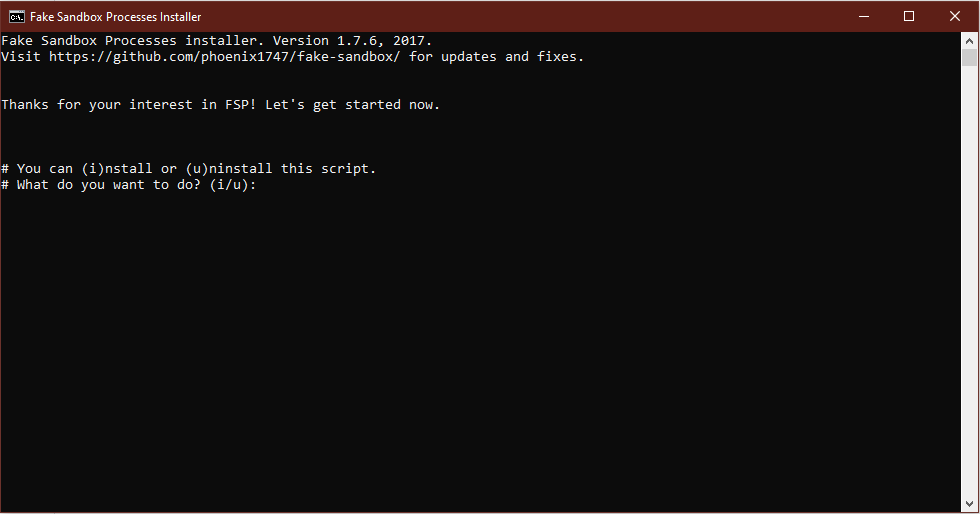
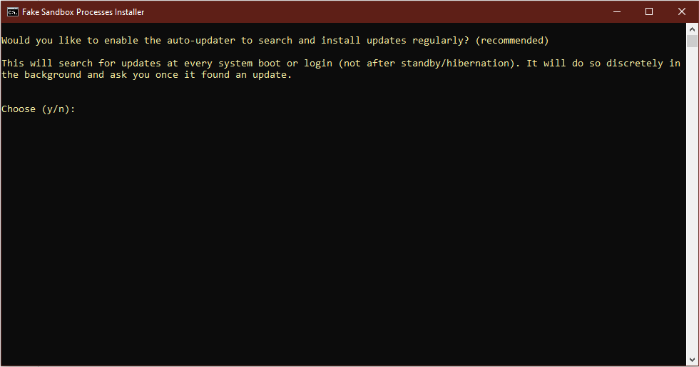
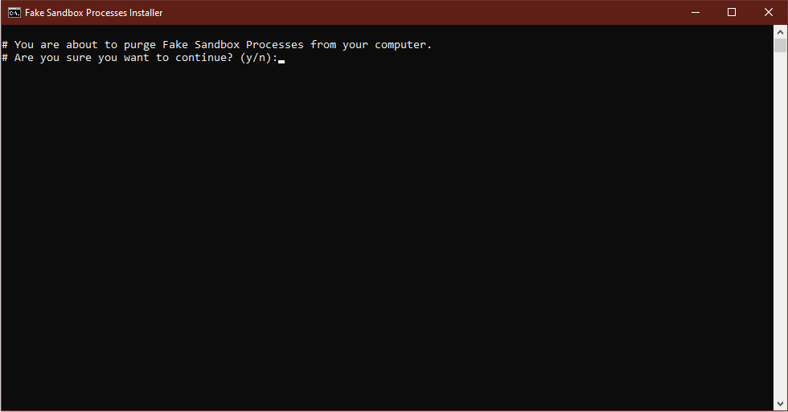

# Fake Sandbox Processes (FSP)
   

This small script will simulate fake processes of analysis, sandbox and VM software that some malware will try to avoid.
You can download the original script made by @x0rz [here](https://gist.github.com/x0rz/e8b36fee33b87aa7e4e5dfd4c0cfc1a6) (thanks, by the way).

You can also download my slightly optimized script from the root directory. The file is named ```fsp.ps1```. This exact script is also used in the FSP installer.

---

### Script-Features

* Some (more advanced) spyware might stop executing correctly as long as the created processes run.
* Requirements: Powershell (preinstalled on Win 7 and newer), that's all.
* No system load.
* Easy to use.

### Installer-Features

* Automatically install the script to your autostart directory, so that you don't have to execute it at every re-login.
* Requirements: Only Powershell.
* With uninstaller to purge all files.
* Everything packed into one tiny offline package.
* Optional updater included, you can choose if you want it or not.

---

### Usage:

Right-click the file and choose "Run with Powershell"

~ OR ~

Open the command line and paste this command (don't forget to adjust the path):

```Powershell -executionpolicy remotesigned -F 'Your\Path\fsp.ps1'```

After pressing enter you can choose to either start or stop all processes.

### Autostart

If you're just using the script and start it manually, you will have to re-run it at every re-login or startup to create the processes again.
In order to autostart the script I made an easy-to-use installer.

1. Download the ```fsp-installer.bat``` file from the release section or from the folder ```installer```.
2. Double-click it.
3. Now you will see this command prompt window:



4. Choose "i" to start the installation.
5. Now enter "y" to start installing or "n" to abort.
6. If you entered "y" this image will now pop up:



7. Enter "y" to install the auto-updater or "n" to not install it (it'll work anyways, but the updater is recommended).

---> You can now close the window or press any key to close it. The installation is complete.

#### Uninstall

If you no longer want this program on your computer, you'll need the ```fsp-installer.bat``` file again.
Run it and chose "u" to start the removal process. Then enter "y" if you are ready to purge all created files.



If the process was successful, you'll see a confirmation screen - done.

---

Successfully tested on the following Windows versions:

* Win 10 Professional
* Win 8.1 Home
* Win 7 Professional
